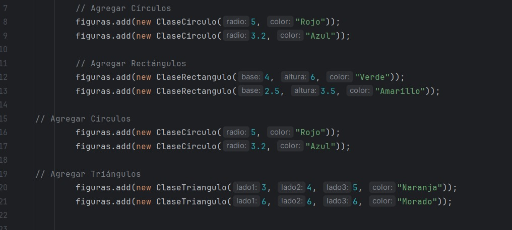
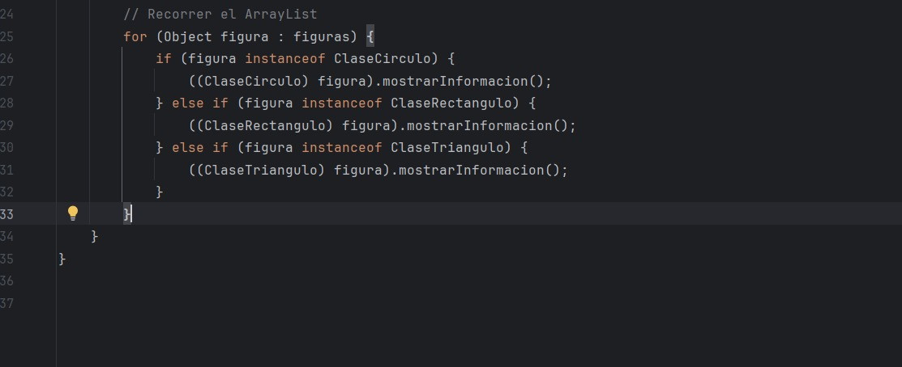
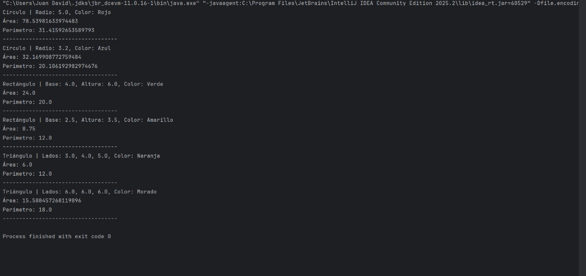

# Taller: Uso de ArrayList con Clases en Java

## Breve explicación de la solución implementada
Se implementaron tres clases (`ClaseCirculo`, `ClaseRectangulo` y `ClaseTriangulo`) con atributos y métodos para calcular área y perímetro, y un `ProgramaPrincipal` que crea un `ArrayList` con objetos de estas clases y recorre la colección para mostrar la información en consola.

---

## Evidencias

### 1. Creación de objetos de cada figura
(Se muestra el fragmento del código donde se crean los objetos)

---

### 2. Inserción de las figuras en el ArrayList
(Se muestra la parte donde se usa `figuras.add(...)`)

---

### 3. Resultados de área y perímetro calculados por cada objeto
(Salida de la consola mostrando área y perímetro)

## Conclusión
Con el programa se demuestra el uso correcto de clases, métodos y de la colección `ArrayList` para almacenar y manipular objetos de distintos tipos. Se incluyen evidencias de creación, inserción y resultados en consola.

